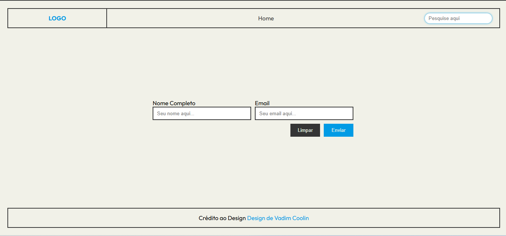

# Primeiro Website

Um projeto web simples desenvolvido com HTML, CSS e JavaScript.

## Páginas

- **Home** - Página inicial com apresentação
- **Produtos** - 4 páginas de produtos (1-4)
- **Formulário** - Página com formulário de contato

## Estrutura

```
frontend/
  ├── pages/     - HTML das páginas
  ├── script/    - JavaScript
  └── assets/    - Imagens e recursos
```

---





